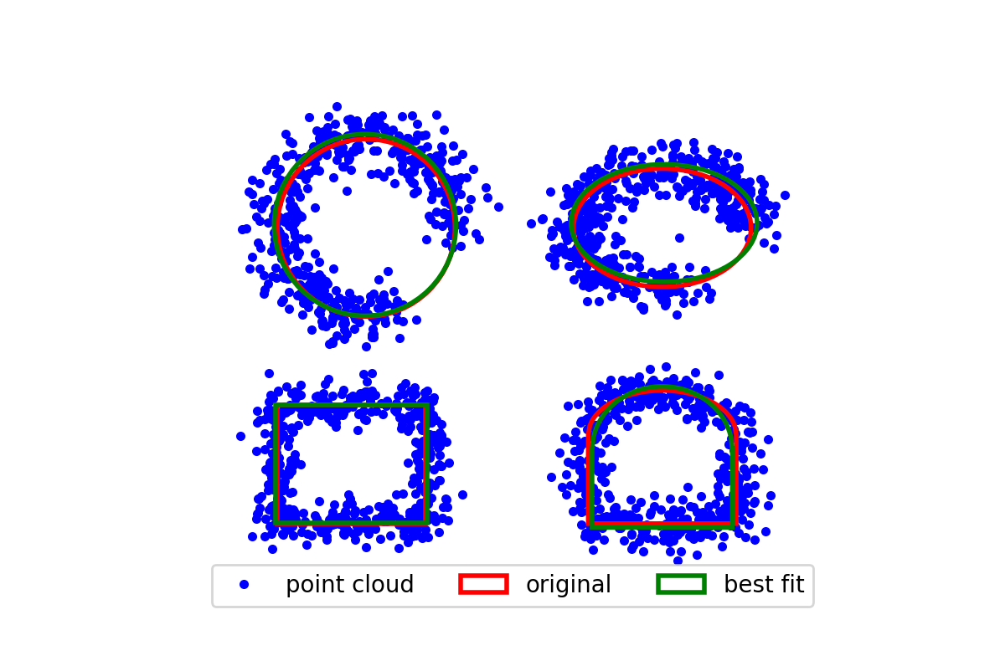
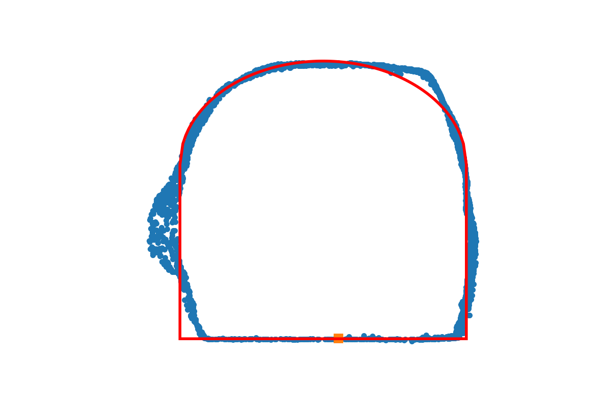
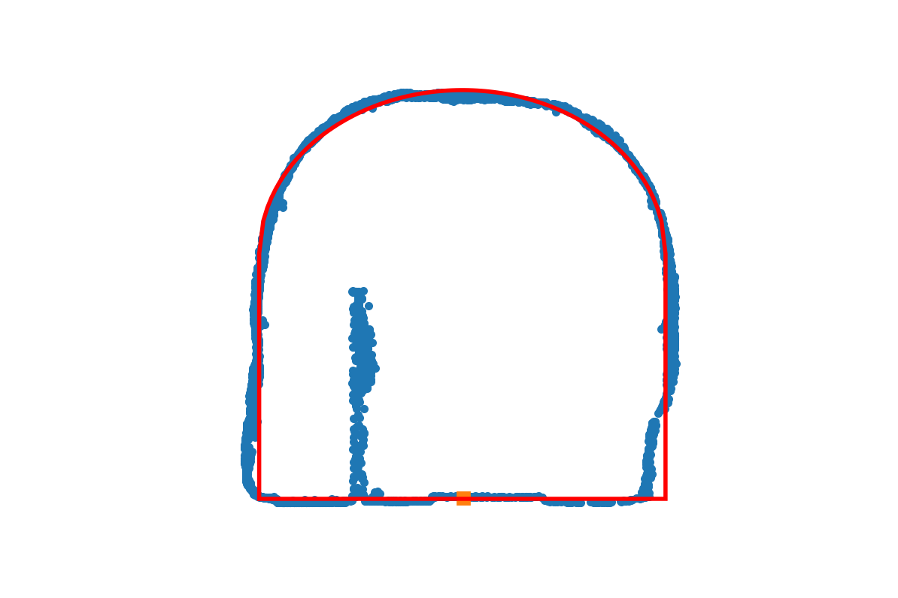
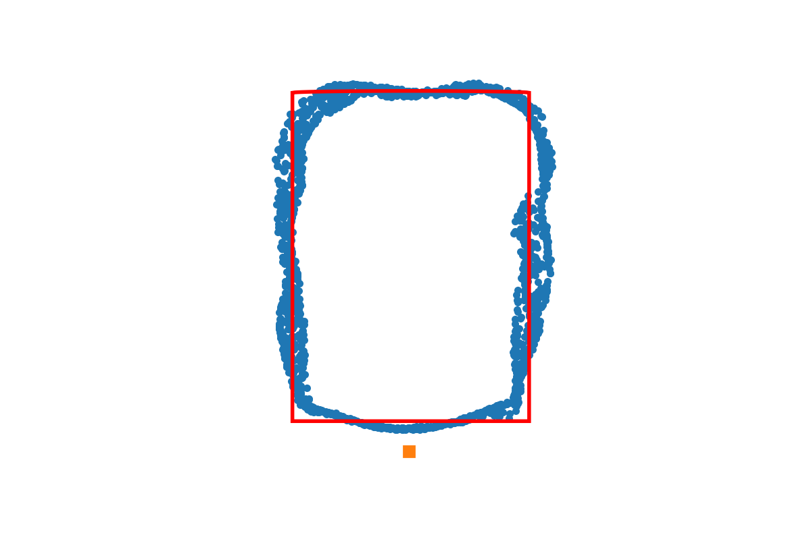
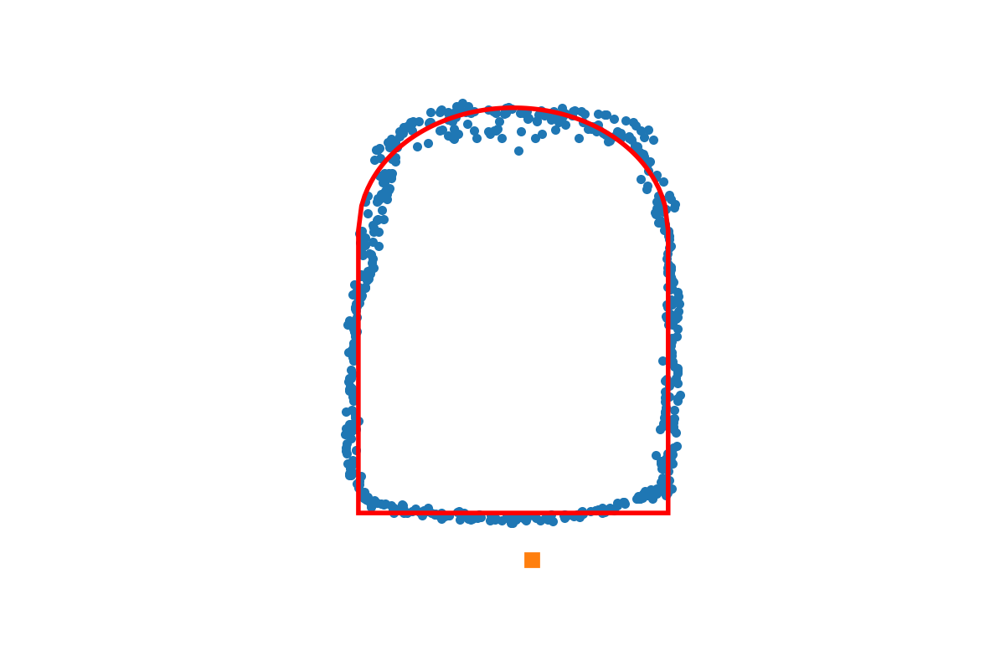

# fit cloud point
Python library for fitting various shapes to point cloud in 2D

This library has classes for the following shapes:
1) circle
2) ellipse
3) rectangle
4) dommed tunnel segment

Each class can
1) creating cloud point in a given shape with gaussian noise
2) calculate distance from any cloud point to a given shape
3) find optimal shape (of each type) that fits any cloud point
4) import, export and plot given shape

## Gallery of other plots

